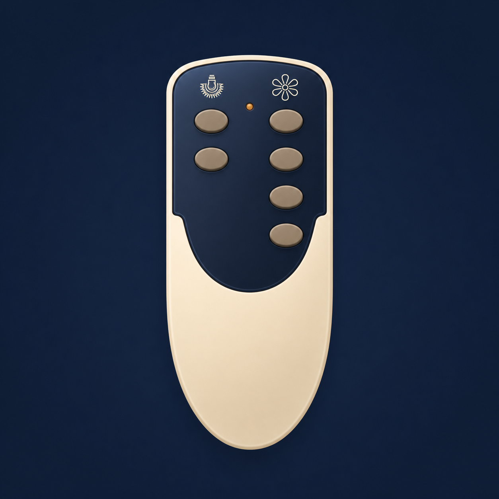
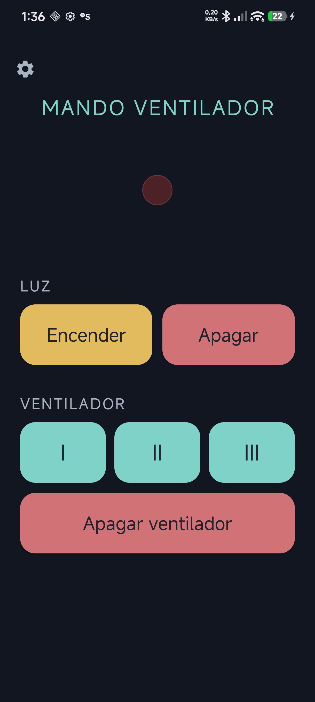

# Ventilador IR

<p align="center">
  
</p>

Proyecto para capturar, decodificar y reproducir el mando infrarrojo de un
ventilador con luz y tres velocidades.

Incluye:

- un sketch para Arduino Pro Micro que captura la envolvente de la señal IR
  desde el ánodo del LED del mando;
- la configuración final `mando_v4.irplus` para irplus;
- una aplicación Android nativa que reproduce los seis comandos usando el
  emisor IR integrado del teléfono;
- herramientas Python para capturas, decodificación y generación de códigos.

## Hardware de captura

- Arduino Pro Micro basado en ATmega32U4, alimentado por USB;
- masa del mando unida a GND del Arduino;
- ánodo del LED IR del mando conectado directamente a `D2`, sin resistencia
  serie;
- cátodo del LED IR del mando conectado a GND;
- `D2` configurado como `INPUT`, sin `INPUT_PULLUP`.

La conexión captura la portadora de aproximadamente 38 kHz. El sketch filtra
esa portadora por software y conserva la envolvente de la señal.

## Protocolo y códigos

Se trata de una variante F12 compatible con BA5104/SC5104: portadora de
38 kHz, unidad nominal de unos 422 µs y tramas de 12 bits. Cada pulsación
envía dos cabeceras fijas y repite la trama del botón.

| Botón | Código |
|---|---|
| Luz ON | `110000001000` (`0xC08`) |
| Luz OFF | `110000100000` (`0xC20`) |
| Ventilador I | `110000000001` (`0xC01`) |
| Ventilador II | `110000000100` (`0xC04`) |
| Ventilador III | `110001000011` (`0xC43`) |
| Ventilador OFF | `110000010000` (`0xC10`) |

La explicación detallada está en [`analisis.md`](analisis.md).

## Arduino

El sketch usa el puerto serie a 115200 baudios:

- `c`: arma una captura individual y muestra los tiempos RAW filtrados;
- `r`: registra los seis botones en la EEPROM;
- `5` y `6`: repiten el registro de esos botones;
- `d`: vuelca las firmas comprimidas de la EEPROM;
- `?`: muestra la ayuda.

Con Arduino CLI:

```bash
arduino-cli compile --fqbn arduino:avr:leonardo .
arduino-cli upload --fqbn arduino:avr:leonardo --port /dev/ttyACM1 .
```

Comprueba el puerto con `arduino-cli board list`; puede cambiar durante el
reinicio o la carga.

## Aplicación Android

La aplicación de [`android_app/`](android_app/) necesita un teléfono con
bláster IR y soporte para una portadora de 38 kHz. No usa Internet ni permisos
de ejecución.

### Descarga

[Descargar la APK de la versión 1.3](releases/MANDO-v1.3.apk)

### Captura de pantalla

<p align="center">
  
</p>

Requisitos: Android Studio con Android SDK 36 y JDK 17 o posterior. Desde la
carpeta `android_app`:

```bash
./gradlew assembleDebug
```

El APK se genera en `app/build/outputs/apk/debug/app-debug.apk`.
